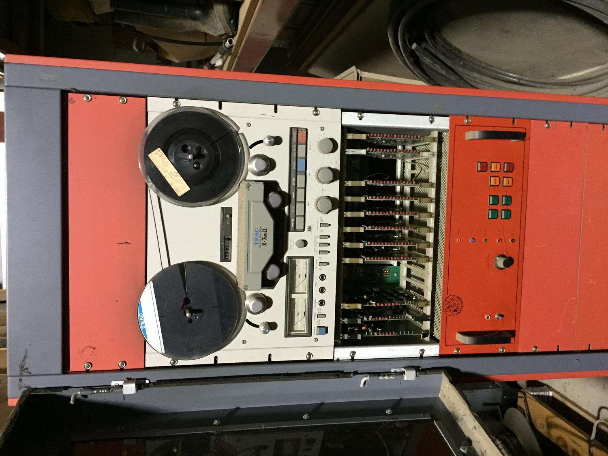

# Unofficial Cyberamic Control Center Archive #

This archive contains unofficial information about the Animatronics Control Computer designed the original Chuck E Cheese's Pizza Time Theatre.  The focus of this archive is to document the historical development and capabilities of this machine.

It was reused in several incarnations over it's lifetime:

## Reel to Reel Configuration: ##
* Based on a 6502 processor and a TEAC Tape Deck, this computer controller the shows such as Dolli Dimples, The Beagles, The King, and the Balcony Stage.

## SVHS Configuration #1: ##
* This same hardware was adapted to play media from SVHS Media.

## SVHS Configuration #2: ##
* Upgraded with a M68HC11 processor, and an external media switcher, this continued to be used to play SVHS media.

## DVD Configuration: ##
* Adapted to DVD Media

If you have any more information or experience with this machine, and would like to help document it's history and behavior, please reach out!

# Questions: #

We're working on collecting as much information on how the original Pizza Time Theater system worked and have generated some questions:

Where did the original voice mic plug in?

Did the original R2R system use 4-track audio?
Did the SVHS system use 4-track audio?

Backplane - did any versions have J19 added?  Otherwise how to they do audio out in all the stores?
was the original card cage a different size to accomodate the 0004 rev.a card?
Why is the lights 50-pin connector recessed on the card compared to the character card?

Are there more board revisions beyond what we have? looking for:
	Audio board 0003 rev.a, rev.b, and beyond rev.c
	Audio board 0033 rev.b and beyond
	Character board 0004 rev.c and beyond
	Character board 0034 rev.b, rev.f and beyond
	Light board 0021 rev.b to rev.e
	Transport board 0020 rev.a
		Did the original transport card take a external uart clock? per the schematic
	Transport board 0020 rev.c
	CPU board 0001 rev.d and beyond 
	Random movements board?
	Board 0002?

where are any other rom variants? how many are there and can we get copies?
	How do the other ROMs handle the buttons on the front panel?
	Are there really different tones encoded between tracks and the code looks for a specific one or does it just count to keep track of where it is?
	Did subsequent ROMs drop support for the original 0003 and 0004 audio/character card combo?

Any more un-scanned documentation?
	Are there any more schematics? 
	Any documentation on how to hook up all the shows?

more show tapes on original media?
	more shows decoded?
		what are the formats for the decoding?
	Is there any metadata they missed like potnetially more tracks?

who else to talk to on this subject?

extra parts we don't have?

We'll have more questions later as we think about this more.
